# Dokumentasi dan Analisis Sistem Informasi Perpustakaan

## 1. Analisis `routes/web.php`
Sistem perutean (routing) pada aplikasi ini telah memisahkan akses pengguna berdasarkan *Role-Based Access Control* (RBAC) menggunakan *middleware* `auth` dan `role`:
- **Admin Only (`role:admin`)**: Admin memiliki hak akses penuh (CRUD) terhadap resource master, yaitu `members`, `categories`, dan `books`. Admin juga memiliki rute spesifik untuk memproses peminjaman, yaitu menerima pengembalian buku (`borrowings.return`) dan menandai keterlambatan manual (`borrowings.late`).
- **Admin & Member**: Rute yang bisa diakses oleh kedua entitas (dengan perbedaan data yang ditampilkan melalui kontroler). Ini mencakup melihat daftar peminjaman (`borrowings.index`), melihat dashboard/katalog (`member.home`), melakukan peminjaman buku (`borrow.book`), serta melihat dan membayar denda (`fines.index`, `fines.pay`, `fines.late`).
- **Profile**: Rute standar untuk manajemen akun pengguna (Edit, Update, Destroy) yang dapat diakses semua *authenticated user*.

## 2. Analisis MVC (Model, View, Controller) dan Migrasi
- **Migrasi & Model**: 
  - `User`: Menangani akun login.
  - `Member`: Berisi detail profil spesifik pengguna yang mendaftar sebagai anggota perpustakaan (berelasi dengan `User`).
  - `Category`: Data referensi kategori buku.
  - `Book`: Entitas buku yang mencakup informasi *title, author, cover, stock,* dan *sinopsis*. Berelasi dengan `Category`.
  - `Borrowing`: Entitas transaksional untuk mencatat proses peminjaman. Memiliki properti *borrow_date, due_date, return_date,* dan *status*. Berelasi dengan `Book` dan `Member`.
  - `Fine`: Entitas transaksional denda yang terhubung ke `Borrowing`. Memiliki properti *amount* (nominal denda) dan *payment_status* (belum/sudah dibayar).
- **Controller**:
  - `BookController, CategoryController, MemberController`: Meng-handle operasi standar CRUD untuk data master. Admin menggunakan ini untuk mengelola perpustakaan.
  - `BorrowingController`: Mengatur logika bisnis peminjaman. Terdapat validasi ketat (maksimal pinjam 3 buku, stok buku harus > 0, tidak boleh meminjam buku yang sama secara ganda). Controller ini juga memproses pengembalian buku (menambah kembali stok) dan otomatis mengkalkulasi denda (Rp3.000/hari) jika terlambat.
  - `FineController`: Menangani penampilan data denda. Untuk Member, *query* difilter agar hanya memunculkan dendanya sendiri. Controller ini juga menyediakan *method* untuk simulasi pembayaran denda (`pay`).
- **View**: Direktori dipisahkan berdasar fungsionalitas dan aktor (misal `admin.home`, `members.home`). Tampilan menggunakan sistem *templating* Blade dari Laravel untuk merender data secara dinamis dari Controller.

## 3. Analisis Alur Kerja Aplikasi (Workflow)

**Alur Kerja Admin:**
1. **Dashboard**: Admin login dan melihat statistik jumlah buku, kategori, dan peminjaman yang masih aktif.
2. **Manajemen Master Data**: Admin bertugas mengelola katalog (Tambah, Edit, Hapus buku dan kategorinya) serta mengelola data anggota (Member).
3. **Pemrosesan Pengembalian**: Saat member mengembalikan buku, admin mencari data peminjaman di sistem dan menekan *Return*. Sistem akan memeriksa apakah tanggal saat ini melewati batas pengembalian (`due_date`).
4. **Kalkulasi Denda**: Jika pengembalian terlambat, sistem otomatis meng-generate data `Fine` dan menambahkannya ke tagihan member terkait. Stok buku kembali bertambah.

**Alur Kerja Member:**
1. **Katalog & Dashboard**: Member login dan melihat katalog buku yang tersedia beserta riwayat ringkas pinjamannya.
2. **Peminjaman Buku**: Member dapat menekan tombol pinjam pada buku. Sistem memvalidasi ketersediaan stok dan limitasi (maks. 3 buku aktif). Jika berhasil, stok buku berkurang 1.
3. **Riwayat Peminjaman**: Member dapat memantau buku apa saja yang belum mereka kembalikan beserta tanggal jatuh temponya.
4. **Penyelesaian Denda**: Jika member terlambat mengembalikan buku dan dikenakan denda oleh admin, member dapat melihat rincian dendanya di halaman *Fines* dan melakukan pelunasan tagihan.

---

## 4. DFD (Data Flow Diagram) Level 0 & Level 1

Berikut adalah pemodelan UML/Diagram aliran data dari aplikasi menggunakan Mermaid.

### DFD Level 0 (Context Diagram)
Menggambarkan interaksi sistem perpustakaan secara keseluruhan dengan entitas eksternal (Admin dan Member).

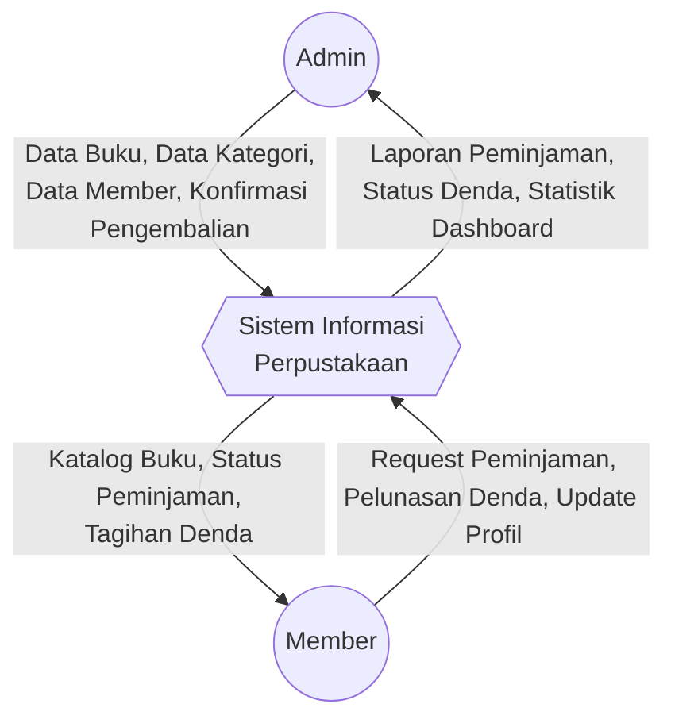

### DFD Level 1
Memecah Sistem Utama ke dalam proses-proses inti (Manajemen Master, Peminjaman, dan Denda).

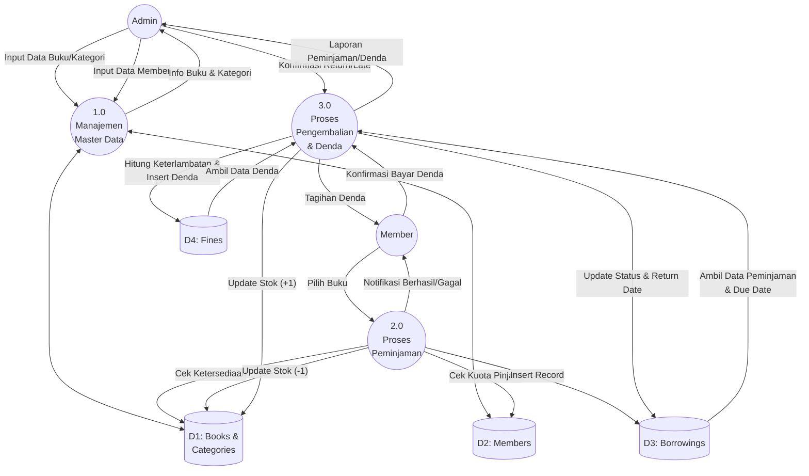

### DFD Level 2 (Rincian Proses)
Memecah masing-masing proses utama pada DFD Level 1 menjadi sub-proses yang lebih detail.

#### DFD Level 2 - Proses 1.0 (Manajemen Master Data)
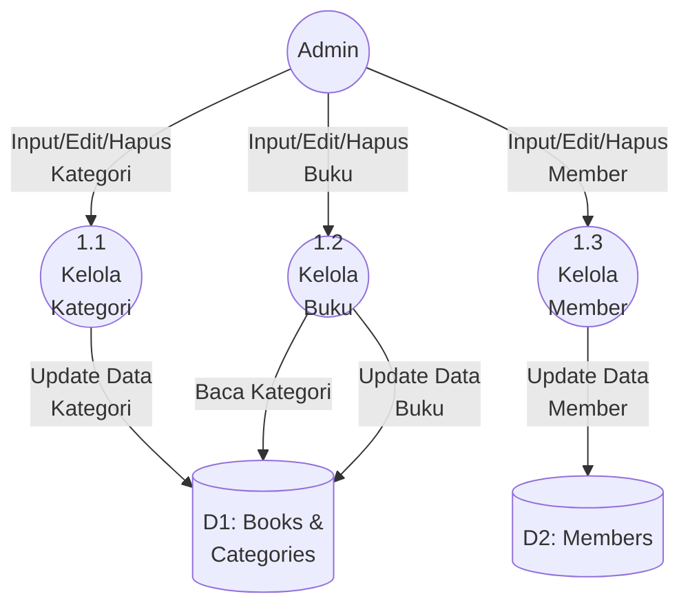

#### DFD Level 2 - Proses 2.0 (Proses Peminjaman)
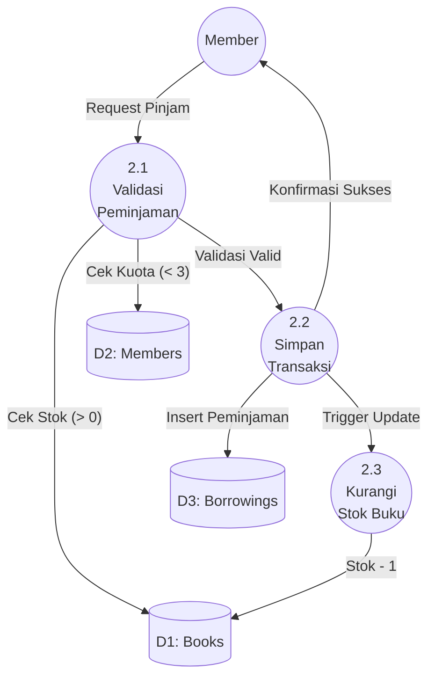

#### DFD Level 2 - Proses 3.0 (Proses Pengembalian & Denda)
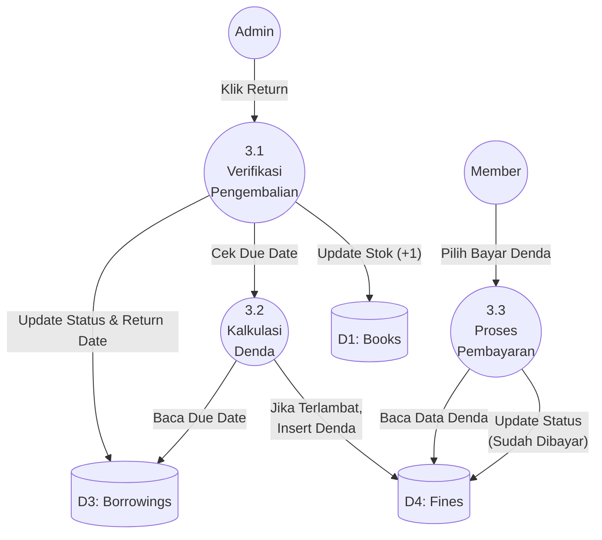

## 5. Sequence Diagram

Berikut adalah diagram sekuensial (Sequence Diagram) yang memodelkan interaksi antara aktor (User/Admin/Member) dan sistem perpustakaan dari awal proses hingga operasi terselesaikan ke database.

### 5.1. Sequence Diagram Login
Alur saat pengguna (Admin atau Member) melakukan autentikasi ke dalam sistem.

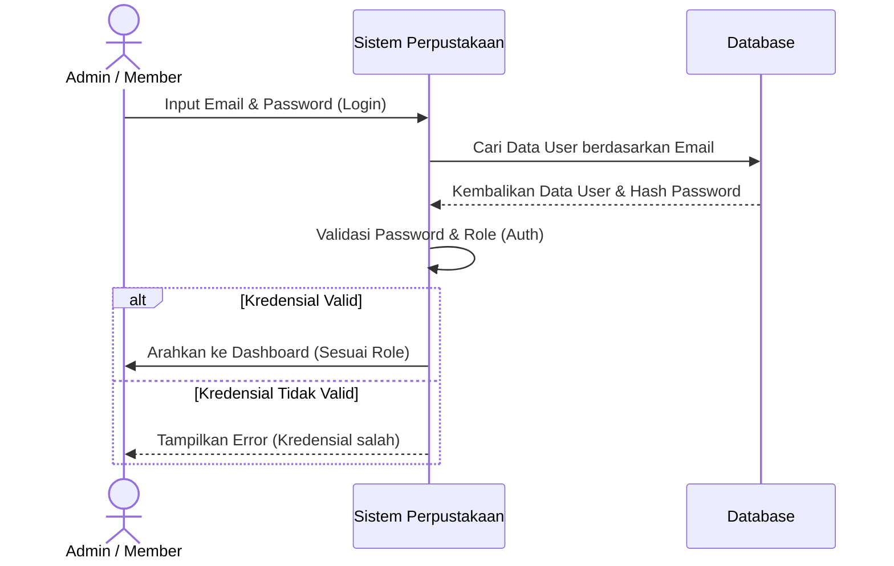

### 5.2. Sequence Diagram Peminjaman Buku
Alur ketika Member mengajukan peminjaman sebuah buku dari katalog.

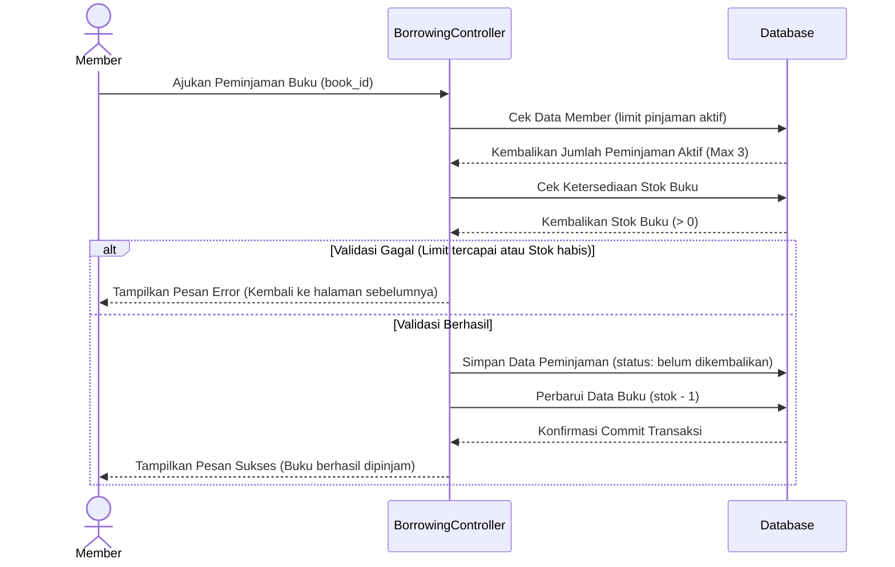

### 5.3. Sequence Diagram Pengembalian Buku
Alur ketika Admin memproses pengembalian buku dari Member, yang juga akan mengecek apakah terjadi keterlambatan dan secara otomatis membuat denda.

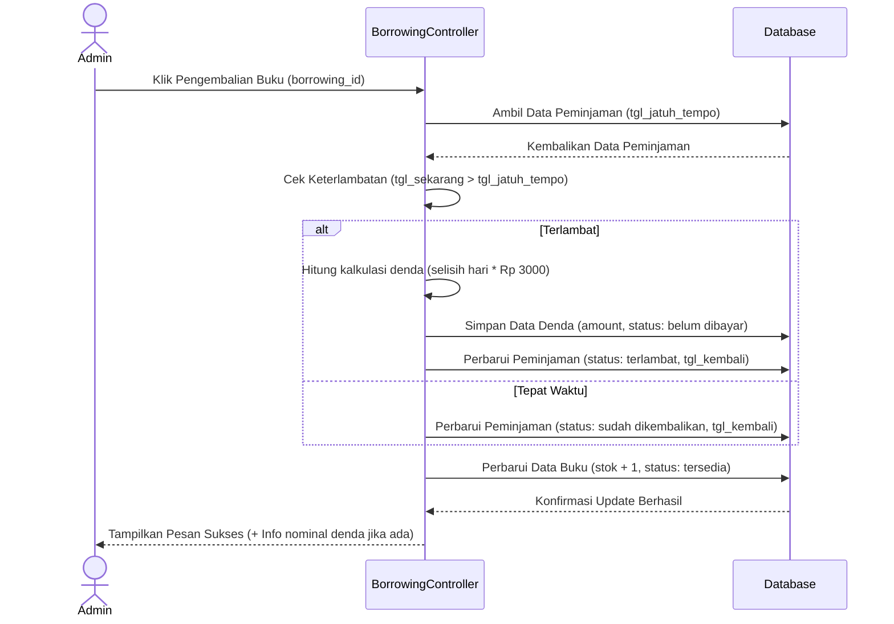

### 5.4. Sequence Diagram Pembayaran Denda
Alur ketika Member melihat daftar denda dan menekan tombol pembayaran pada suatu tanggungan denda.

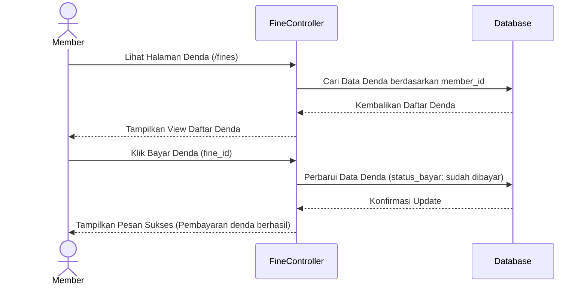
## 6. Activity Diagram & Flowchart

Bagian ini memodelkan alur kerja (workflow) menggunakan diagram aktivitas yang difokuskan pada aktor (menggunakan konsep *swimlanes*) dan juga bagan alir (flowchart) keseluruhan aplikasi.

### 6.1. Activity Diagram: Proses Peminjaman Buku
Alur langkah demi langkah ketika Member mencoba meminjam buku, beserta validasi yang terjadi di dalam Sistem.

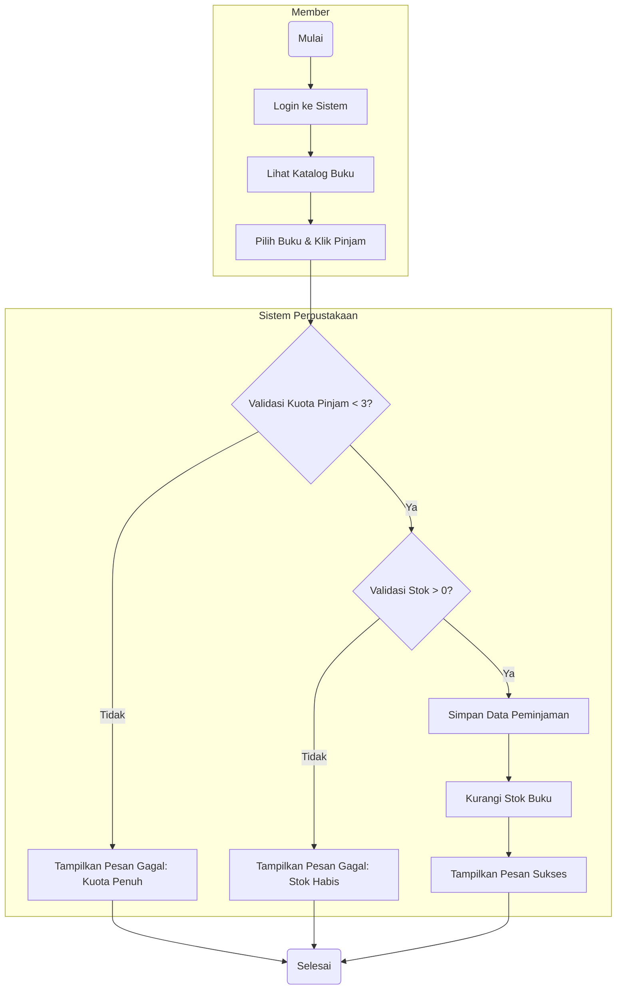

### 6.2. Activity Diagram: Proses Pengembalian Buku
Alur ketika Admin memproses buku yang dikembalikan oleh Member, termasuk logika penentuan denda secara otomatis.

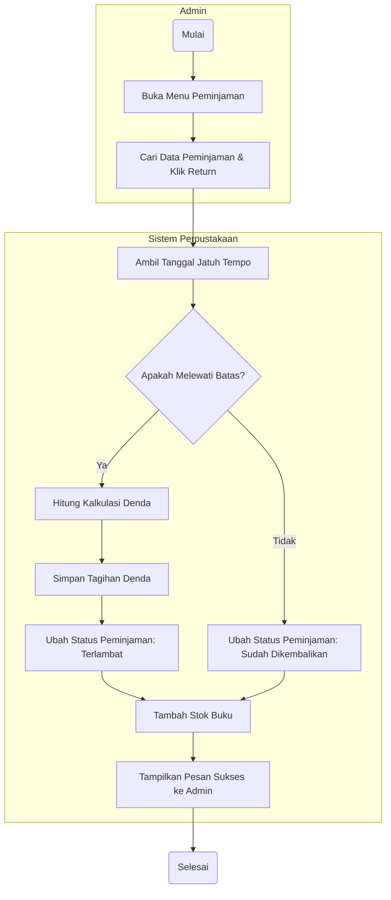

### 6.3. Flowchart Utama Aplikasi
Bagan alir yang merangkum fungsionalitas keseluruhan aplikasi berdasarkan peran pengguna (*Role*).

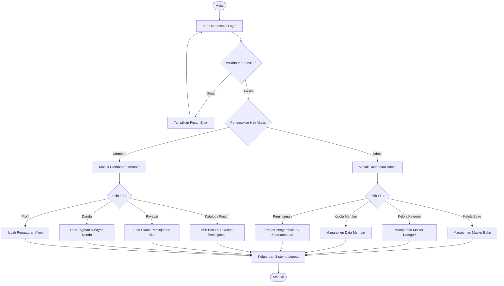

## 7. Database Diagram (DBML)

Bagian ini mendefinisikan struktur *database* perpustakaan secara utuh berdasarkan file _Migration_ Laravel, menggunakan sintaks DBML (Database Markup Language). 

```dbml
Table users {
  id integer [primary key]
  name varchar
  email varchar [unique]
  email_verified_at timestamp
  password varchar
  remember_token varchar
  created_at timestamp
  updated_at timestamp
}

Table categories {
  id integer [primary key]
  name varchar
  created_at timestamp
  updated_at timestamp
}

Table books {
  id integer [primary key]
  category_id integer [not null]
  cover varchar
  title varchar
  author varchar
  stock integer
  sinopsis varchar
  created_at timestamp
  updated_at timestamp
}

Table members {
  id integer [primary key]
  user_id integer [not null]
  member_code integer [unique]
  name varchar
  email varchar [unique]
  address varchar
  phone varchar [unique]
  created_at timestamp
  updated_at timestamp
}

Table borrowings {
  id integer [primary key]
  book_id integer [not null]
  member_id integer [not null]
  borrow_date date
  due_date date
  return_date date [null]
  status varchar [note: "enum('sudah dikembalikan', 'belum dikembalikan', 'terlambat')"]
  created_at timestamp
  updated_at timestamp
}

Table fines {
  id integer [primary key]
  borrowing_id integer [not null]
  amount integer
  payment_status varchar [note: "enum('belum dibayar', 'sudah dibayar')"]
  created_at timestamp
  updated_at timestamp
}

// Relasi (Relationships)
Ref: books.category_id > categories.id // Many-to-One
Ref: members.user_id - users.id // One-to-One
Ref: borrowings.book_id > books.id // Many-to-One
Ref: borrowings.member_id > members.id // Many-to-One
Ref: fines.borrowing_id - borrowings.id // One-to-One
```

### Visualisasi ERD (Entity Relationship Diagram)
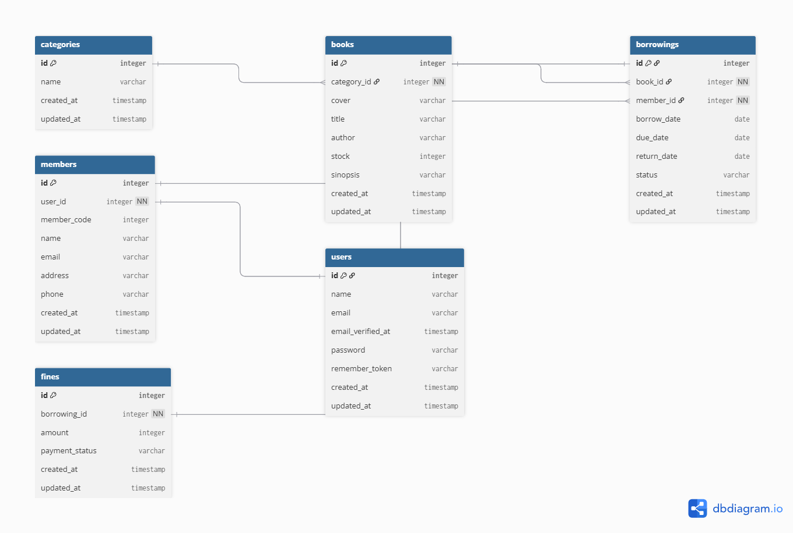

---

## 8. Laporan Pengujian (Testing)

Sistem telah diuji menggunakan framework pengujian terintegrasi bawaan Laravel (Pest/PHPUnit) dengan database `mini_projek_testing` MySQL. Seluruh skenario pengujian utama (31 pengujian, 74 asersi) telah menunjukkan hasil **Lulus (PASS)** tanpa ada *error* atau ketidakcocokan.

Berikut adalah rekapitulasi pengujian fitur-fitur pada aplikasi berdasarkan standar spesifikasi:

### Requirement
| Requirement ID | Requirement |
|---|---|
| FR-01 | Sistem harus mengizinkan pengguna untuk mendaftar akun baru dan menyimpannya ke tabel member. |
| FR-02 | Sistem harus mengizinkan pengguna login menggunakan *email* dan *password* yang valid. |
| FR-03 | Sistem harus menolak login jika *email* atau *password* salah. |
| FR-04 | Sistem harus mengarahkan pengguna yang berhasil login ke halaman dashboard yang sesuai. |
| FR-05 | Admin dapat mengelola data master (Kategori, Buku, dan Member) termasuk menambah, mengubah, dan menghapus. |
| FR-06 | Sistem harus memblokir akses member biasa dari fitur pengelolaan data master. |
| FR-07 | Member dapat meminjam maksimal 3 buku dan stok buku harus otomatis berkurang. |
| FR-08 | Sistem harus menolak peminjaman jika stok habis atau kuota maksimal member telah tercapai. |
| FR-09 | Admin dapat memproses pengembalian buku, yang akan menambah kembali stok buku. |
| FR-10 | Sistem otomatis menghitung denda (Rp3.000/hari) jika buku dikembalikan melewati batas waktu (*due date*). |
| FR-11 | Admin dapat memverifikasi pembayaran denda dan status tagihan berubah menjadi "sudah dibayar". |

### Test Scenario
| Scenario ID | Requirement ID | Test Scenario |
|---|---|---|
| TS-AUTH-01 | FR-01, FR-02, FR-04 | Pendaftaran dan Autentikasi Login Pengguna dengan data valid |
| TS-AUTH-02 | FR-03 | Autentikasi Login dengan data tidak valid |
| TS-ADMIN-01 | FR-05, FR-06 | Manajemen Data Master (CRUD Kategori, Buku, Member) oleh Admin |
| TS-BORROW-01 | FR-07, FR-08 | Proses Pengajuan Peminjaman Buku oleh Member |
| TS-RETURN-01 | FR-09, FR-10, FR-11 | Proses Pengembalian Buku, Kalkulasi Denda, dan Pembayaran |

### Test Condition
| Condition ID | Scenario ID | Test Condition | Status |
|---|---|---|---|
| TCOND-01 | TS-AUTH-01 | Pendaftaran akun baru dengan data lengkap (`Auth\RegistrationTest`) | ✅ PASS |
| TCOND-02 | TS-AUTH-01 | Login dengan data valid dan redirect ke dashboard (`Auth\AuthenticationTest`) | ✅ PASS |
| TCOND-03 | TS-AUTH-02 | Login dengan *password* salah ditolak (`Auth\AuthenticationTest`) | ✅ PASS |
| TCOND-04 | TS-ADMIN-01 | Admin membuat, mengubah, dan menghapus Kategori (`CategoryFeatureTest`) | ✅ PASS |
| TCOND-05 | TS-ADMIN-01 | Admin membuat buku baru dan memperbarui stok beserta cover (`BookFeatureTest`) | ✅ PASS |
| TCOND-06 | TS-ADMIN-01 | Admin menghapus data member dari database (`MemberFeatureTest`) | ✅ PASS |
| TCOND-07 | TS-ADMIN-01 | Member biasa ditolak mengakses halaman CRUD Master Data (Status 403) | ✅ PASS |
| TCOND-08 | TS-BORROW-01 | Member meminjam buku dan stok berkurang (`BorrowingActionTest`) | ✅ PASS |
| TCOND-09 | TS-BORROW-01 | Member ditolak meminjam jika stok buku 0 (`BorrowingActionTest`) | ✅ PASS |
| TCOND-10 | TS-BORROW-01 | Member ditolak meminjam buku ke-4 saat kuota penuh (`BorrowingActionTest`) | ✅ PASS |
| TCOND-11 | TS-RETURN-01 | Admin memproses pengembalian tanpa denda dan stok bertambah | ✅ PASS |
| TCOND-12 | TS-RETURN-01 | Pengembalian terlambat otomatis membuat baris denda (`BorrowingLateTest`) | ✅ PASS |
| TCOND-13 | TS-RETURN-01 | Validasi perhitungan nominal denda akurat di MySQL (`BorrowingLateTest`) | ✅ PASS |
| TCOND-14 | TS-RETURN-01 | Mengubah status *payment* denda menjadi "sudah dibayar" | ✅ PASS |
