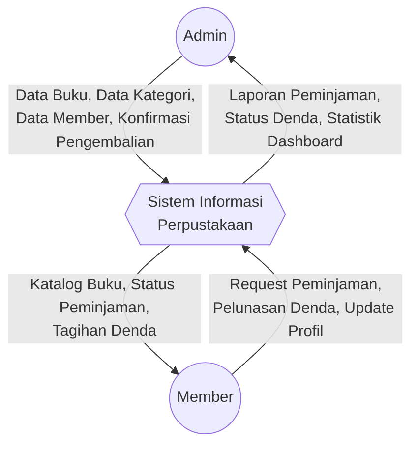
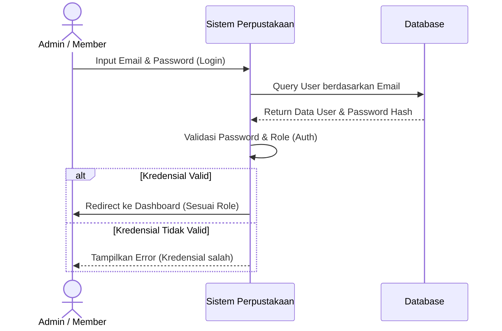
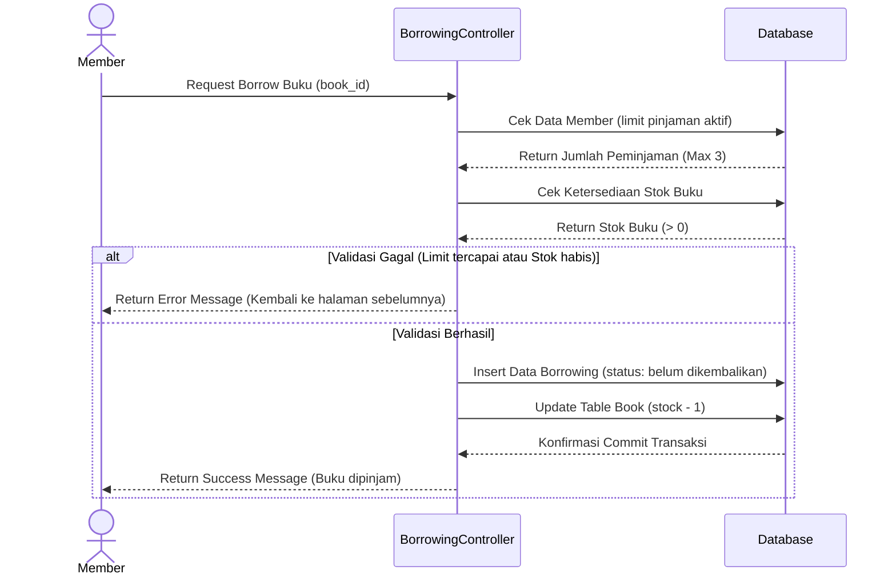
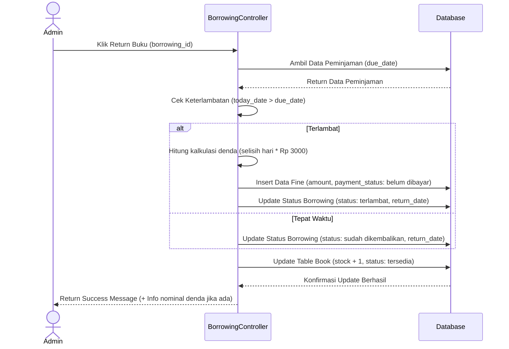
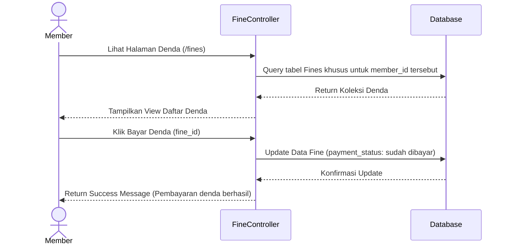
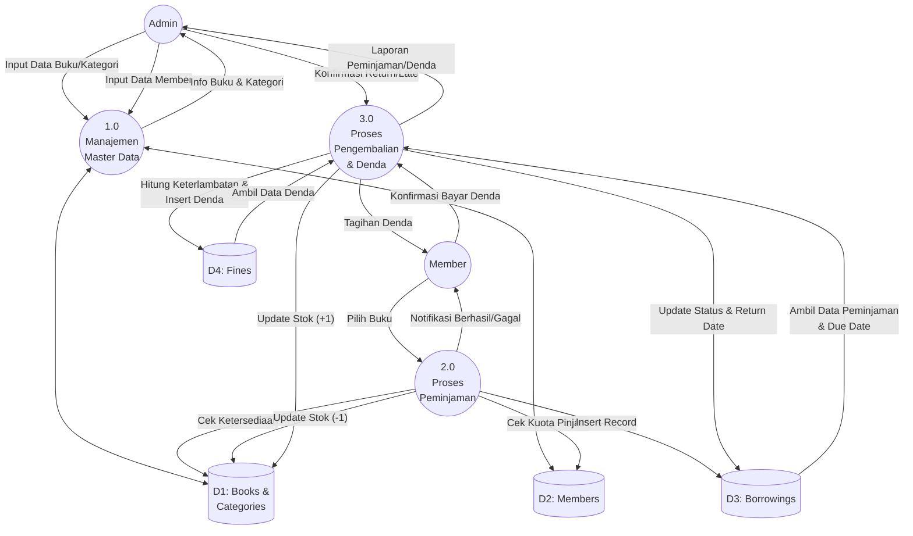

# Dokumentasi dan Analisis Sistem Informasi Perpustakaan

## 1. Analisis `routes/web.php`
Sistem perutean (routing) pada aplikasi ini telah memisahkan akses pengguna berdasarkan *Role-Based Access Control* (RBAC) menggunakan *middleware* `auth` dan `role`:
- **Admin Only (`role:admin`)**: Admin memiliki hak akses penuh (CRUD) terhadap resource master, yaitu `members`, `categories`, dan `books`. Admin juga memiliki rute spesifik untuk memproses peminjaman, yaitu menerima pengembalian buku (`borrowings.return`) dan menandai keterlambatan manual (`borrowings.late`).
- **Admin & Member**: Rute yang bisa diakses oleh kedua entitas (dengan perbedaan data yang ditampilkan melalui kontroler). Ini mencakup melihat daftar peminjaman (`borrowings.index`), melihat dashboard/katalog (`member.home`), melakukan peminjaman buku (`borrow.book`), serta melihat dan membayar denda (`fines.index`, `fines.pay`, `fines.late`).
- **Profile**: Rute standar untuk manajemen akun pengguna (Edit, Update, Destroy) yang dapat diakses semua *authenticated user*.

## 2. Analisis MVC (Model, View, Controller) dan Migrasi
- **Migrasi & Model**: 
  - `User`: Menangani akun login.
  - `Member`: Berisi detail profil spesifik pengguna yang mendaftar sebagai anggota perpustakaan (berelasi dengan `User`).
  - `Category`: Data referensi kategori buku.
  - `Book`: Entitas buku yang mencakup informasi *title, author, cover, stock,* dan *sinopsis*. Berelasi dengan `Category`.
  - `Borrowing`: Entitas transaksional untuk mencatat proses peminjaman. Memiliki properti *borrow_date, due_date, return_date,* dan *status*. Berelasi dengan `Book` dan `Member`.
  - `Fine`: Entitas transaksional denda yang terhubung ke `Borrowing`. Memiliki properti *amount* (nominal denda) dan *payment_status* (belum/sudah dibayar).
- **Controller**:
  - `BookController, CategoryController, MemberController`: Meng-handle operasi standar CRUD untuk data master. Admin menggunakan ini untuk mengelola perpustakaan.
  - `BorrowingController`: Mengatur logika bisnis peminjaman. Terdapat validasi ketat (maksimal pinjam 3 buku, stok buku harus > 0, tidak boleh meminjam buku yang sama secara ganda). Controller ini juga memproses pengembalian buku (menambah kembali stok) dan otomatis mengkalkulasi denda (Rp3.000/hari) jika terlambat.
  - `FineController`: Menangani penampilan data denda. Untuk Member, *query* difilter agar hanya memunculkan dendanya sendiri. Controller ini juga menyediakan *method* untuk simulasi pembayaran denda (`pay`).
- **View**: Direktori dipisahkan berdasar fungsionalitas dan aktor (misal `admin.home`, `members.home`). Tampilan menggunakan sistem *templating* Blade dari Laravel untuk merender data secara dinamis dari Controller.

## 3. Analisis Alur Kerja Aplikasi (Workflow)

**Alur Kerja Admin:**
1. **Dashboard**: Admin login dan melihat statistik jumlah buku, kategori, dan peminjaman yang masih aktif.
2. **Manajemen Master Data**: Admin bertugas mengelola katalog (Tambah, Edit, Hapus buku dan kategorinya) serta mengelola data anggota (Member).
3. **Pemrosesan Pengembalian**: Saat member mengembalikan buku, admin mencari data peminjaman di sistem dan menekan *Return*. Sistem akan memeriksa apakah tanggal saat ini melewati batas pengembalian (`due_date`).
4. **Kalkulasi Denda**: Jika pengembalian terlambat, sistem otomatis meng-generate data `Fine` dan menambahkannya ke tagihan member terkait. Stok buku kembali bertambah.

**Alur Kerja Member:**
1. **Katalog & Dashboard**: Member login dan melihat katalog buku yang tersedia beserta riwayat ringkas pinjamannya.
2. **Peminjaman Buku**: Member dapat menekan tombol pinjam pada buku. Sistem memvalidasi ketersediaan stok dan limitasi (maks. 3 buku aktif). Jika berhasil, stok buku berkurang 1.
3. **Riwayat Peminjaman**: Member dapat memantau buku apa saja yang belum mereka kembalikan beserta tanggal jatuh temponya.
4. **Penyelesaian Denda**: Jika member terlambat mengembalikan buku dan dikenakan denda oleh admin, member dapat melihat rincian dendanya di halaman *Fines* dan melakukan pelunasan tagihan.

---

## 4. DFD (Data Flow Diagram) Level 0 & Level 1

Berikut adalah pemodelan UML/Diagram aliran data dari aplikasi menggunakan Mermaid.

### DFD Level 0 (Context Diagram)
Menggambarkan interaksi sistem perpustakaan secara keseluruhan dengan entitas eksternal (Admin dan Member).

## 5. Sequence Diagram

Berikut adalah diagram sekuensial (Sequence Diagram) yang memodelkan interaksi antara aktor (User/Admin/Member) dan sistem perpustakaan dari awal proses hingga operasi terselesaikan ke database.

### 5.1. Sequence Diagram Login
Alur saat pengguna (Admin atau Member) melakukan autentikasi ke dalam sistem.

### 5.2. Sequence Diagram Peminjaman Buku
Alur ketika Member mengajukan peminjaman sebuah buku dari katalog.

### 5.3. Sequence Diagram Pengembalian Buku
Alur ketika Admin memproses pengembalian buku dari Member, yang juga akan mengecek apakah terjadi keterlambatan dan secara otomatis membuat denda.

### 5.4. Sequence Diagram Pembayaran Denda
Alur ketika Member melihat daftar denda dan menekan tombol pembayaran pada suatu tanggungan denda.

### DFD Level 1
Memecah Sistem Utama ke dalam proses-proses inti (Manajemen Master, Peminjaman, dan Denda).

